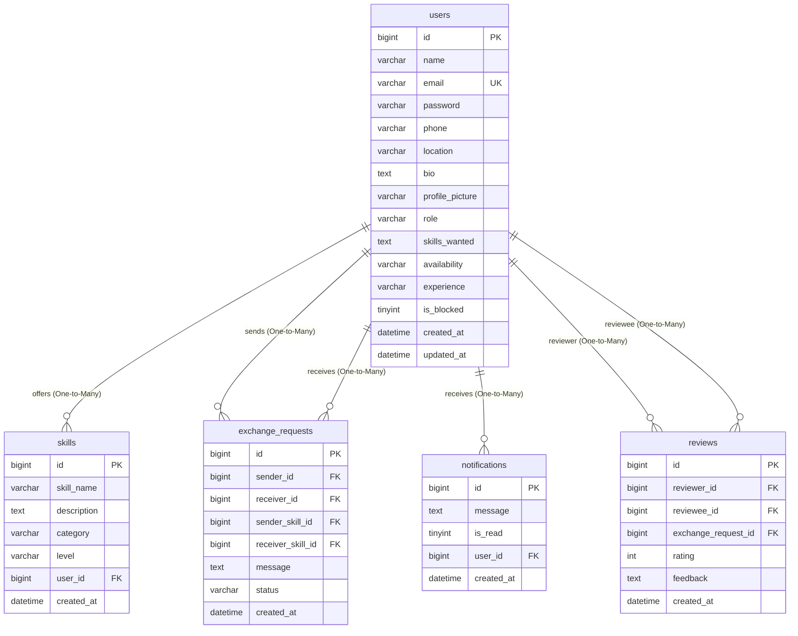

# Skill Swap – Skill Exchange Platform

Skill Swap is a production-quality, modern, full-stack peer-to-peer web application designed for knowledge barter. Users can display their expertise (skills offered), request exchanges with other users (skills wanted), accept/reject exchange offers, track swap milestones, receive notifications, and leave ratings/feedback upon completion. Admins have access to a dashboard displaying global statistics, with tools to block/delete users and moderate skills.

---

## Technical Stack

- **Frontend**: React.js (Vite), React Router v6, Axios, Tailwind CSS, React Hook Form, React Toastify, Material UI Icons.
- **Backend**: Java 17, Spring Boot 3.2.2, Spring Security 6, JWT Authentication, Spring Data JPA, Hibernate, Maven.
- **Database**: MySQL.
- **Documentation**: Swagger/OpenAPI (Springdoc).

---

## Folder Structure

```text
skill-swap/
├── database.sql                       # MySQL schema creation and sample seed data script
├── skill_swap_postman_collection.json # Exported Postman collection for API testing
├── backend/                           # Spring Boot Maven Project
│   ├── pom.xml                        # Maven Dependencies Configuration
│   └── src/
│       └── main/
│           ├── java/com/skillswap/
│           │   ├── SkillSwapApplication.java
│           │   ├── config/            # SecurityConfig, WebMvcConfig, OpenApiConfig
│           │   ├── controller/        # REST Controllers (Auth, User, Skill, Exchange, etc.)
│           │   ├── dto/               # Data Transfer Objects (Request/Response bodies)
│           │   ├── entity/            # JPA Entities (User, Skill, ExchangeRequest, etc.)
│           │   ├── exception/         # Custom Exceptions and Global Exception Handler
│           │   ├── mapper/            # Type-safe entity-to-dto converters
│           │   ├── repository/        # Spring Data JPA Repositories
│           │   ├── security/          # JWT Filters, Tokens, UserDetails service
│           │   └── util/              # Helper utilities (FileUploadUtil)
│           └── resources/
│               └── application.properties # Server, Database connection, and JWT parameters
└── frontend/                          # React client application (Vite)
    ├── package.json
    ├── tailwind.config.js
    ├── postcss.config.js
    └── src/
        ├── App.jsx                    # Route mapping and context binding
        ├── main.jsx
        ├── index.css                  # Tailwind styles and glassmorphism definitions
        ├── api/
        │   └── client.js              # Axios instance configured with JWT refresh interceptors
        ├── components/
        │   ├── Navbar.jsx
        │   ├── Footer.jsx
        │   ├── ProtectedRoute.jsx     # Auth checking and role-based route guard
        │   └── LoadingSkeleton.jsx    # Visual shimmer loaders
        ├── context/
        │   └── AuthContext.jsx        # Login, Register, Logout hooks
        └── pages/                     # Page components (Landing, Profile, Search, etc.)
```

---

## Entity Relationship Diagram (ERD)



---

## Installation & Running Instructions

### 1. Database Setup
1. Ensure your MySQL Server is running locally.
2. Run the `database.sql` script located in the project root directory. This creates the `skillswap` database, tables, foreign key constraints, and seeds mock records (users, skills, requests, reviews).
   ```bash
   mysql -u your_username -p < database.sql
   ```

### 2. Backend Server Execution
1. Navigate to the `backend` folder:
   ```bash
   cd backend
   ```
2. Open `src/main/resources/application.properties` and verify your MySQL connection details:
   ```properties
   spring.datasource.url=jdbc:mysql://localhost:3306/skillswap?createDatabaseIfNotExist=true&useSSL=false&serverTimezone=UTC
   spring.datasource.username=YOUR_MYSQL_USERNAME
   spring.datasource.password=YOUR_MYSQL_PASSWORD
   ```
3. Run the Spring Boot application using Maven:
   ```bash
   mvn spring-boot:run
   ```
   The backend server will start on port `8080`.
4. **API Documentation**: Once running, access the interactive Swagger UI API interface at:
   - [http://localhost:8080/swagger-ui.html](http://localhost:8080/swagger-ui.html)
   - OpenAPI specifications: [http://localhost:8080/v3/api-docs](http://localhost:8080/v3/api-docs)

### 3. Frontend Client Execution
1. Navigate to the `frontend` folder:
   ```bash
   cd ../frontend
   ```
2. Install the node dependencies:
   ```bash
   npm install
   ```
3. Boot the local development server:
   ```bash
   npm run dev
   ```
   The client application will run on [http://localhost:5173](http://localhost:5173).

---

## Barter API Endpoints Catalog

### Authentication (`/api/auth`)
- `POST /api/auth/register`: Signup a new user.
- `POST /api/auth/login`: Authenticate email/password. Returns JWT, refresh token, and user metadata.
- `POST /api/auth/refresh?refreshToken=...`: Renew expired access tokens using the refresh token.
- `POST /api/auth/logout`: Invalidates the session.
- `POST /api/auth/forgot-password`: Generates a password reset token (logged on stdout).
- `POST /api/auth/reset-password`: Resets user password using the token.
- `POST /api/auth/change-password`: Modifies current password (authenticated).

### User Operations (`/api/users`)
- `GET /api/users`: Search and filter users by name, location, experience, availability, or skills with pagination/sorting.
- `GET /api/users/{id}`: Fetch profile information and offered skills.
- `PUT /api/users/{id}`: Modify details of a specific user.
- `DELETE /api/users/{id}`: Delete user (Admin only).
- `GET /api/users/profile`: Load current user's profile.
- `PUT /api/users/profile`: Update details of current user.
- `POST /api/users/profile/picture`: Upload multipart profile picture stored locally.
- `PUT /api/users/{id}/block?block=true`: Lock/unlock user accounts (Admin only).
- `GET /api/users/admin/stats`: Get platform-wide counters and metrics (Admin only).

### Skill Catalog (`/api/skills`)
- `POST /api/skills`: Create a new skill (Programming, Cooking, Fitness, etc.).
- `GET /api/skills`: List all active skills (paginated).
- `GET /api/skills/{id}`: Fetch single skill info.
- `PUT /api/skills/{id}`: Update a skill.
- `DELETE /api/skills/{id}`: Remove a skill.
- `GET /api/skills/user/{userId}`: Fetch all skills registered by a specific user.

### Swap Exchanges (`/api/exchanges`)
- `POST /api/exchanges`: Submit a skill exchange proposal.
- `GET /api/exchanges`: Retrieve user's swap requests.
- `PUT /api/exchanges/{id}/accept`: Accept a swap proposal.
- `PUT /api/exchanges/{id}/reject`: Decline a swap proposal.
- `PUT /api/exchanges/{id}/complete`: Finalize a swap.

### Notifications (`/api/notifications`)
- `GET /api/notifications`: Retrieve current user's notifications.
- `PUT /api/notifications/read/{id}`: Mark a notification read.

### Feedback Reviews (`/api/reviews`)
- `POST /api/reviews`: Submit a rating and review for a user after a completed exchange.
- `GET /api/reviews/user/{id}`: Retrieve all reviews posted about a user.

---

## Testing APIs with Postman

1. Open Postman.
2. Click **Import** and select the `skill_swap_postman_collection.json` file from the project root.
3. Once imported, click the **Login** request inside the *Authentication* folder and hit send.
4. The login request contains a test script that automatically registers the JWT Bearer Token (`jwt_token`) and Refresh Token (`refresh_token`) variables in your environment.
5. All other requests will automatically append this `Bearer {{jwt_token}}` header in their Authorization configurations, allowing you to test authenticated paths instantly!
